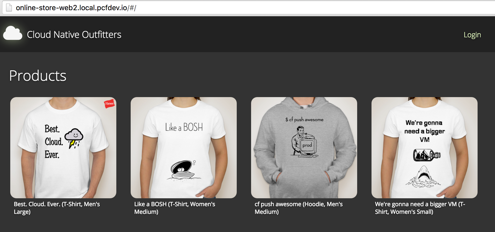
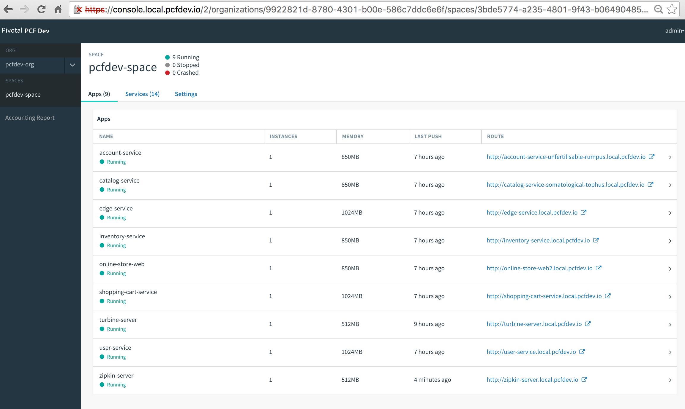

# Spring Cloud Event Sourcing Example
original source code is here https://github.com/kbastani/spring-cloud-event-sourcing-example

this project added following features to the original project:
* hystrix using stream(rabbitmq)
* sleuth, zipkin tracing using HTTP 
* can deploy to pcfdev, a lightweight Pivotal Cloud Foundry (PCF) for desktop (https://network.pivotal.io/products/pcfdev)

* Spring Cloud OAuth2
  * Authorization Server
  * Resource Server
* Edge Service
  * API gateway with OAuth2 protected resources
  * OAuth2 SSO
* Event-driven Messaging
  * Event sourcing

## Architecture Diagram


## Online Store Domain

This reference application is based on common design patterns for building an ecommerce application. The application includes the following microservices.

* Discovery Service
* Edge Service
* User Service
* Catalog Service
* Account Service
* Order Service
* Inventory Service
* Online Store Web
* Shopping Cart Service

## Usage

Microservice architectures commonly use multiple databases. The resources of the business domain are distributed across the microservice architecture, with each service having its own exclusive database. Each type of database for a microservice is commonly chosen by a development team based on its advantages when solving a specific problem.

This reference application uses the following mixture of databases.

* MySQL - RDBMS
* Redis - Key/value Store
* RabbitMQ- messaging

### Integration Testing

If you would like to use Docker for integration testing, a `docker-compose.yml` file has been provided in the root directory. To build all the images, first make sure that you have Docker installed and available in your command line tool. With Docker and Docker Compose installed, execute the provided `run.sh` script. This script will build each container and start each of the services and database dependencies. When all the services have started up. Verify that the services are registered with Eureka at `http://$DOCKER_IP:8761`.

If everything has loaded correctly, navigate to the online store at `http://DOCKER_IP:8787/`. Click `Login`. You'll be navigated to the authorization server's gateway at `http://DOCKER_IP:8181/uaa/login`. The username is `user` and the password is `password`. You'll be authenticated and asked to approve token grant to the online web store. After accepting the grant, you'll be redirected to the online store application where you'll be able to access protected resources from the edge service.

### Deploy to Pivotal Cloud Foundry

1. pcf resource requirements

* more than 11GB app memory.

1. make sure backend service installed on PCF marketplace.
* p-mysql
* p-rabbitmq
* p-redis

1. target to PCF
```
cf login -a api.your.pcf.deployment
```

1. install all apps to PCF

```
deploy.sh
```

1. navigate apps.

check if all app is registered to discovery-service. then go to online-store web http://online-store-web2.YOUR.PCF.DOMAIN
login with user/password


### screen shot




## License

This project is licensed under Apache License 2.0.
